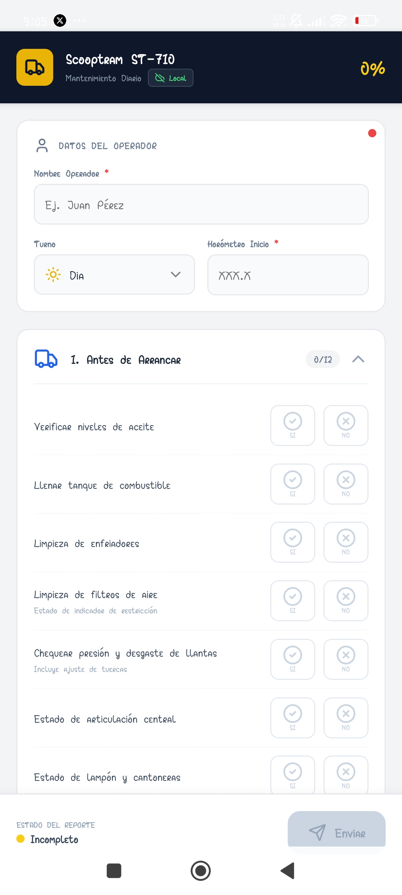
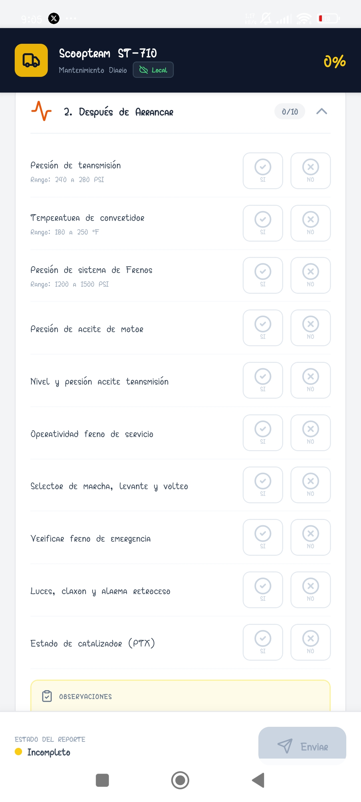
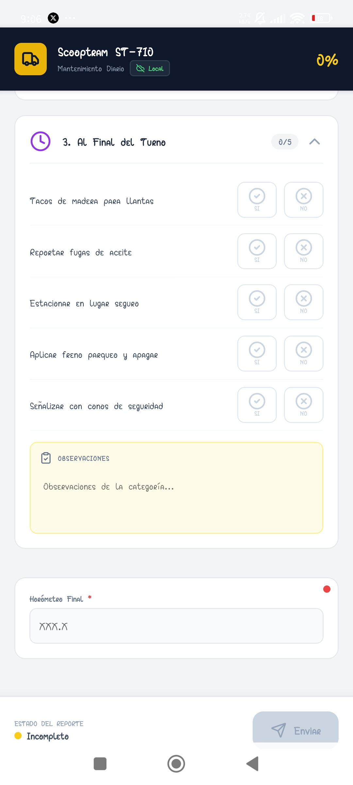

# App: Generación de Reportes de Mantenimiento de ScoopTRAM DIESEL ST-710

Este proyecto es una aplicación móvil desarrollada con **React Native** y **TypeScript** diseñada para digitalizar el proceso de **Mantenimiento Diario (Checklist)** de maquinaria pesada minera, específicamente el equipo _Scooptram ST-710_.

La aplicación reemplaza los formatos de papel tradicionales, permitiendo a los operadores realizar inspecciones pre-operacionales, registrar horómetros y enviar reportes en tiempo real a un servidor centralizado, con capacidad de guardado local (borradores) para evitar pérdida de datos.

## Funcionalidades Principales

- **Gestión de Datos del Operador:** Registro del nombre del operador, selección de turno (Día, Tarde, Noche) mediante un modal interactivo y captura de horómetros (inicial y final).
- **Checklist Interactivo:** Sistema de inspección dividido en tres fases críticas:
  1.  Antes de Arrancar.
  2.  Después de Arrancar.
  3.  Al Final del Turno.
- **Validación en Tiempo Real:** Indicadores visuales de progreso, validación de campos obligatorios y bloqueo de envío hasta completar el 100% del reporte.
- **Persistencia de Datos (Drafts):** Guardado automático del progreso en el dispositivo (`AsyncStorage`) para recuperar la información si la app se cierra inesperadamente.
- **Reporte de Fallos y Observaciones:** Capacidad para marcar ítems como "OK" o "Fallo" y agregar observaciones de texto libre por categoría.

## Arquitectura y Componentes Técnicos

El código está construido sobre una arquitectura de componentes funcionales utilizando Hooks. A continuación se detallan los componentes y librerías clave:

### 1. Interfaz de Usuario (UI/UX)

- **Acordeón Dinámico (`LayoutAnimation`):** Las categorías de inspección se comportan como un acordeón colapsable. Al abrir una sección, la vista realiza un _scroll automático_ (`scrollViewRef`) para posicionar el contenido visiblemente para el usuario.
- **Componentes Nativos:** Se hace uso extensivo de `TextInput`, `TouchableOpacity`, `Modal` y `ScrollView`.
- **Iconografía:** Integración de `lucide-react-native` (Truck, User, Activity, etc.) para una interfaz visual intuitiva.
- **Safe Area:** Implementación de `react-native-safe-area-context` para garantizar la correcta visualización en dispositivos con _notch_ o islas dinámicas.

### 2. Gestión de Estado y Lógica

- **React Hooks:**
  - `useState`: Para manejar el estado del formulario, la inspección (`ok`/`fail`), el progreso y la visibilidad de modales.
  - `useEffect`: Para la carga inicial de datos persistentes y el guardado automático de borradores ante cambios.
  - `useRef`: Para manejar referencias del ScrollView y calcular posiciones en pantalla.
- **Manejo de Formularios:** Funciones personalizadas como `handleNumericInput` para sanitizar la entrada de horómetros (conversión de comas a puntos, solo números).

### 3. Integración y Almacenamiento

- **AsyncStorage:** Se utiliza `@react-native-async-storage/async-storage` para cachear localmente las preferencias del usuario (nombre) y el estado actual del reporte (borrador).
- **Conexión API:** Envío de datos mediante `fetch` a un backend REST (`API_URL`), manejando estados de carga (`isSubmitting`) y alertas de éxito o error de red.

### 4. Estructura Visual del Código

El renderizado se divide en tres bloques principales:

1.  **Header:** Información del equipo, estado de conexión y barra de progreso circular (porcentaje).
2.  **Formulario (Scrollable):** Tarjetas de datos generales y las secciones expandibles del checklist.
3.  **Footer (Sticky):** Barra inferior fija que muestra el estado del reporte ("Incompleto"/"Listo") y contiene el botón de envío.








---

## Instalación y Ejecución

Sigue estos pasos para levantar el proyecto en tu entorno local de desarrollo.

### 1. Prerrequisitos

Asegúrate de tener instalado y configurado lo siguiente:

- **Node.js** (Versión LTS recomendada).
- **React Native CLI** o entorno configurado (Android Studio para Android / Xcode para iOS).
- **Java JDK** (Para compilar en Android).
- **CocoaPods** (Solo si ejecutas en iOS).

### 2. Clonar el repositorio e instalar dependencias

```bash
git clone https://github.com/phinix-pe/reportes-app.git
cd reportes-app
npm install
```

### 3. Configuración de la API

El proyecto apunta por defecto a una URL de producción o desarrollo.

1.  Abre el archivo `App.tsx`.
2.  Ubica la variable `API_URL` al inicio del archivo.
3.  Si estás corriendo el backend localmente, descomenta la línea de localhost y ajusta tu IP:

```typescript
const API_URL = "http://10.0.2.2:8080/api/reports";
```

### 4. Ejecutar la aplicación

Una vez instaladas las dependencias, inicia el servidor Metro y la aplicación:

**Para Develop:**

```bash
npm run web
```

**Para generar el APK:**

```bash
npx eas build -p android --profile preview
```

---

## Author

- **Braulio Maldonado Casilla** - [GitHub Profile](https://github.com/ShinjiMC)

## License

This project is licensed under the MIT License. See the [LICENSE](LICENSE) file for details.
